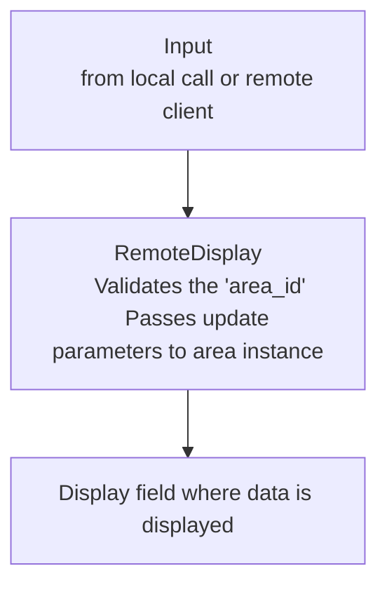

# remote-display

Defines a display with fields (type, size, position, etc.) that can be be updated from the local microprocessor or remote clients.

##  **Class Structure**

## **Basic Operation**





Example usage:
```python
from machine import Pin, SPI

# display_config:
#  Sets display hardware type
#  Set up trace if requested
#  Any other parameters as needed by custom area modules
import dispay_config

from ili9341_display import ILI9341Display

# RemoteDisplay:
#  Reads screen display configuration
#  Accepts area (field) updates
from remote_display import RemoteDisplay

# SPI/display set up
spi = SPI (
    SPI_ID,
    baudrate = BAUDRATE ,
    polarity = POLARITY ,
    phase = PHASE ,
    bits = BITS ,
    sck = Pin (SCK) ,
    mosi = Pin (MOSI) ,
    miso = Pin (MISO)
    )
display = Display (spi,
    width = DISPLAY_WIDTH ,
    height = DISPLAY_HEIGHT ,
    rotation = ROTATION ,
    dc = Pin (DC),
    cs = Pin (CS) ,
    rst = Pin (RST)
    )

# Interface to the display
disp = RemoteDisplay (display_object = display)

# Display screen configuration
disp.setup_config_file ("testscreen.json")

# Update display areas(fields)
disp.update_text_area (area = "UpperRight", value = "Test")
disp.update_text_area (area = "UpperLeft", value = "Upper Left")

disp.page_by_name ("screenexample")
```

## **Screen Configuration File**

testscreen.json :
```json
{
    "page_id" : "screenexample" ,
    "area_id": "displayscreen",
    "vpos": 0,
    "vlen": 240,
    "hpos": 0,
    "hlen": 320,
    "areas": [
        {
            "id": "FirstRow",
            "vpos": 0,
            "vlen": 82,
            "hpos": 0,
            "hlen": 320,
            "areas": [
                {
                    "id": "UpperLeft",
                    "type": "text",
                    "value": "UL: No Value",
                    "hpos": 1,
                    "hlen": 159,
                    "vpos": 1,
                    "vlen": 80,
                    "padding": 1
                },
                {
                    "id": "UpperRight",
                    "type": "text",
                    "value": "UR: No Value",
                    "hpos": 160,
                    "hlen": 159,
                    "vpos": 1,
                    "vlen": 80,
                    "padding": 1
                }
            ]
        }
    ]
}
```
## **REMOTE DISPLAY**

## **AREA MODULES**

### RemoteArea (remote_area.py)

Base class to (almost) all area classes

**Area Configuration Parameters**
|Name|Default|Description|
|:----------------|:----------|:-|
|remote_display|required|Interface to display|
|area_config|{}|From config file/module|
|area_id|None|Reference for updating area values|
|hpos|0|Horizontal position, relative to container xpos|
|hlen|None|Horizontal length|
|vpos|0|Vertical position, relative to container ypos|
|vlen|None|Vertical length|
|borderwidth|0|Pixel width of area border|
|bordercolor|0|Border color|
|paddingwidth|0|Pixel width of padding|
|font|None|Text font|
|show_border_color|"WHITE"|See show_areas|

**Calculated variables**
|Name|Default|Description|
|:-|:-|:-|
|xlen||Field x length|
|xmin||Field x start position|
|xmax||Field x end position|
|xmid||Field x mid point|
|ylen||Field y length|
|ymin||Field y start position|
|ymax||Field y end position|
|ymid||Field y mid point|

### Remote7Segment (remote_7segment.py)

### RemoteContainer (remote_container.py)

### RemoteDateTime (remote_datetime.py)

### RemoteImage (remote_image.py)

### RemoteLinearGauge (remote_linear_gauge.py)

### RemoteLinearGaugeTicks (remote_linear_gauge_ticks.py)

### RemoteSwitchPage (remote_switch_page.py)

### RemoteSysfont (remote_sysfont.py)

### RemoteTemplate (remote_template.py)

### RemoteText (remote_text.py)
