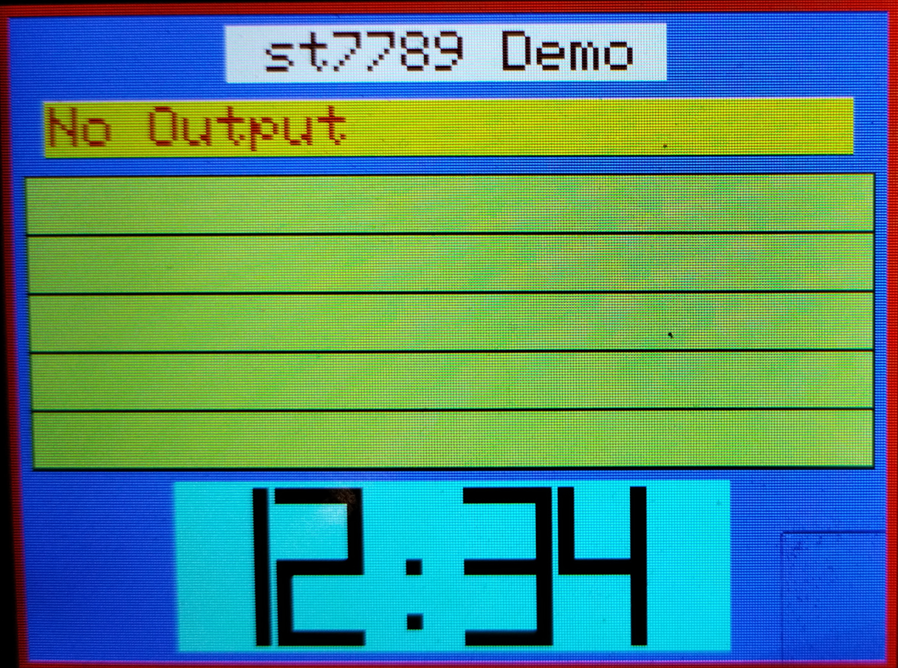

# demo-st7789 - remote_display example using an st7789 display

## Description

This demo runs text screen on a display with an st7789 driver using the SPI interface 

## Requirements

- SPI display
  - st7789 driver
  - 240 width x 320 height

This demo was developed on a Pimoroni Pico Display Pack 2.8" with a Raspberry PI Pico 2 W. The standard micropython firmware was used instead of Pimoroni's version for compatibility.

## Quick Start

**Download the repository**

```text
git clone https://github.com/ctimmer/remote-display.git
cd remote-display
```

**Copy the following display modules files from display_modules/ to demo_st7789/display_modules/**

- remote_display.py
- st7789py.py
- st7789py_display.py
- trace_display.py
- dummy_display.py

**Copy the following area modules files from area_modules/ to demo_tk/area_modules/**

- remote_area.py
- remote_7segment.py
- remote_container.py
- remote_sysfont.py
- remote_text.py

The entire area_modules directory can be copied.

**Scripting**

The bash script **setup.sh** in the demo-tk directory will set up symbolic links to modules. Edit the script setting **GETHUB_DIR** to the repository directory (see example in script).

**Running demo-st7789**

With mpremote
```text
cd demo-st7789
mpremote mount -l . run rem_demo.py
```

With Thonny
```
Upload all files and directories to your device.
Run rem_demo.py on the device
```

**Output**

A window should be opened that looks similar to this:



Text output (unless there are problems):

```
Local directory . is mounted at /remote
End of Demonstration
```
