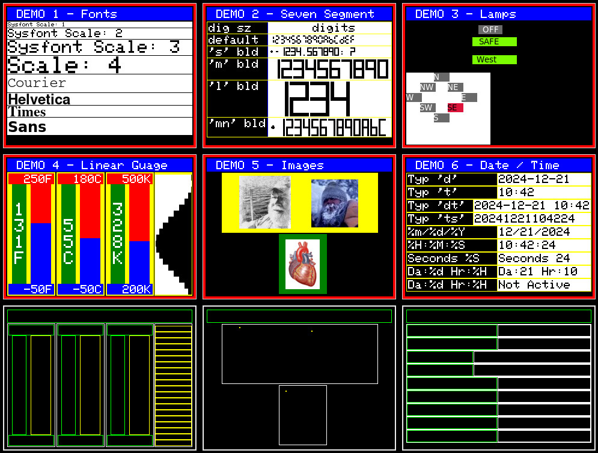

# demo-tk

## Description

This demo simulates 9 320x240 microprocessor compatible displays.
Each display is independent and can be modified/tested without affecting the other displays.

## Requirements

- Python3
- Additional modules
  - tkinter
  - PIL, if using image display demo

## Quick Start

**Download the repository**

```text
git clone https://github.com/ctimmer/remote-display.git
cd remote-display
```

**Copy the following display modules files from display_modules/ to demo_tk/display_modules/**

- remote_display.py
- tkinter_display.py
- trace_display.py
- dummy_display.py

**Copy the following area modules files from area_modules/ to demo_tk/area_modules/**

- remote_area.py
- remote_7segment.py
- remote_container.py
- remote_datetime.py
- remote_image.py
- remote_lamp.py
- remote_linear_gauge.py
- remote_linear_gauge_ticks.py
- remote_sysfont.py
- remote_template.py
- remote_text.py

The entire area_modules directory can be copied.

**Scripting**

The bash script **setup.sh** in the demo-tk directory will set up symbolic links to modules. Edit the script setting **GETHUB_DIR** to the repository directory (see example in script).

**Running demo-tk**

```text
cd demo-tk
python rem_demo.py
```

**Output**

A window should be opened that looks similar to this:



Text output with added notes:

```
import machine Failed           # OK, this is not micropython
Set up dummy ntptime            # OK, this is not micropython
tk_display setup                # Initializing demo-tk
                                # output from the show_area method (see below):
anon x=6 w=308 y=6 h=228 mid=(160,120)
. anon x=10 w=300 y=10 h=14 mid=(160,17)
. anon x=8 w=76 y=31 h=202 mid=(46,132)
.. anon x=10 w=72 y=33 h=14 mid=(46,40)
.. Ftext x=18 w=16 y=53 h=158 mid=(26,132)
.. Fdisplay x=45 w=34 y=49 h=166 mid=(62,132)
.. anon x=10 w=72 y=217 h=14 mid=(46,224)
. anon x=90 w=76 y=31 h=202 mid=(128,132)
.. anon x=92 w=72 y=33 h=14 mid=(128,40)
.. Ctext x=100 w=16 y=53 h=158 mid=(108,132)
.. Cdisplay x=127 w=34 y=49 h=166 mid=(144,132)
.. anon x=92 w=72 y=217 h=14 mid=(128,224)
. anon x=172 w=76 y=31 h=202 mid=(210,132)
.. anon x=174 w=72 y=33 h=14 mid=(210,40)
.. Ktext x=182 w=16 y=53 h=158 mid=(190,132)
.. Kdisplay x=209 w=34 y=49 h=166 mid=(226,132)
.. anon x=174 w=72 y=217 h=14 mid=(210,224)
. anon x=252 w=61 y=30 h=204 mid=(282,132)
.. trig_0 x=252 w=61 y=33 h=10 mid=(282,38)
.. trig_1 x=252 w=61 y=43 h=10 mid=(282,48)
.. trig_2 x=252 w=61 y=53 h=10 mid=(282,58)
.. trig_3 x=252 w=61 y=63 h=10 mid=(282,68)
.. trig_4 x=252 w=61 y=73 h=10 mid=(282,78)
.. trig_5 x=252 w=61 y=83 h=10 mid=(282,88)
.. trig_6 x=252 w=61 y=93 h=10 mid=(282,98)
.. trig_7 x=252 w=61 y=103 h=10 mid=(282,108)
.. trig_8 x=252 w=61 y=113 h=10 mid=(282,118)
.. trig_9 x=252 w=61 y=123 h=10 mid=(282,128)
.. trig_10 x=252 w=61 y=133 h=10 mid=(282,138)
.. trig_11 x=252 w=61 y=143 h=10 mid=(282,148)
.. trig_12 x=252 w=61 y=153 h=10 mid=(282,158)
.. trig_13 x=252 w=61 y=163 h=10 mid=(282,168)
.. trig_14 x=252 w=61 y=173 h=10 mid=(282,178)
.. trig_15 x=252 w=61 y=183 h=10 mid=(282,188)
.. trig_16 x=252 w=61 y=193 h=10 mid=(282,198)
.. trig_17 x=252 w=61 y=203 h=10 mid=(282,208)
.. trig_18 x=252 w=61 y=213 h=10 mid=(282,218)
.. trig_19 x=252 w=61 y=223 h=10 mid=(282,228)
anon x=6 w=308 y=6 h=228 mid=(160,120)
. anon x=10 w=300 y=10 h=14 mid=(160,17)
. anon x=31 w=260 y=30 h=100 mid=(161,80)
.. anon x=61 w=0 y=36 h=0 mid=(61,36)
.. anon x=181 w=0 y=42 h=0 mid=(181,42)
. anon x=126 w=80 y=132 h=100 mid=(166,182)
.. anon x=138 w=0 y=142 h=0 mid=(138,142)
anon x=6 w=308 y=6 h=228 mid=(160,120)
. anon x=10 w=300 y=10 h=14 mid=(160,17)
. anon x=7 w=306 y=31 h=20 mid=(160,41)
.. anon x=9 w=146 y=33 h=16 mid=(82,41)
.. date_1 x=160 w=151 y=33 h=16 mid=(236,41)
. anon x=7 w=306 y=53 h=20 mid=(160,63)
.. anon x=9 w=146 y=55 h=16 mid=(82,63)
.. date_2 x=160 w=151 y=55 h=16 mid=(236,63)
. anon x=7 w=306 y=75 h=20 mid=(160,85)
.. anon x=9 w=106 y=77 h=16 mid=(62,85)
.. date_3 x=120 w=191 y=77 h=16 mid=(216,85)
. anon x=7 w=306 y=97 h=20 mid=(160,107)
.. anon x=9 w=106 y=99 h=16 mid=(62,107)
.. date_4 x=120 w=191 y=99 h=16 mid=(216,107)
. anon x=7 w=306 y=119 h=20 mid=(160,129)
.. anon x=9 w=146 y=121 h=16 mid=(82,129)
.. date_5 x=160 w=151 y=121 h=16 mid=(236,129)
. anon x=7 w=306 y=141 h=20 mid=(160,151)
.. anon x=9 w=146 y=143 h=16 mid=(82,151)
.. date_6 x=160 w=151 y=143 h=16 mid=(236,151)
. anon x=7 w=306 y=163 h=20 mid=(160,173)
.. anon x=9 w=146 y=165 h=16 mid=(82,173)
.. date_7 x=160 w=151 y=165 h=16 mid=(236,173)
. anon x=7 w=306 y=185 h=20 mid=(160,195)
.. anon x=9 w=146 y=187 h=16 mid=(82,195)
.. date_8 x=160 w=151 y=187 h=16 mid=(236,195)
. anon x=7 w=306 y=207 h=20 mid=(160,217)
.. anon x=9 w=146 y=209 h=16 mid=(82,217)
.. date_9 x=160 w=151 y=209 h=16 mid=(236,217)
Starting Display            # Display demo screens
```

- **show_area** method
  - Demos 7,8,9
  - Display output
    - Displays an outline of each of the areas.
  - Text output
    - Hierarchy with "."
    - Area ID, "anon" = no area id
    - X position (absolute) and width
    - Y position (absolute) and height
    - area midpoint coordinates
